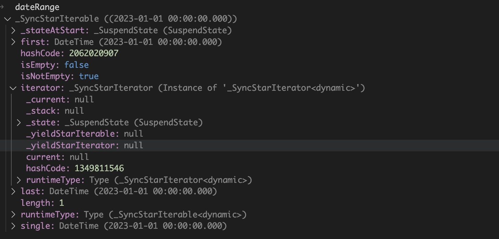

# generator
同步生成器的目的是为开发者提供一种便捷的方式，在避免使用Iterator和Iterable模板代码的情况下，实现对for-in语法的支持。

异步生成器

## for-in
for-in语句必须和[Iterable](https://api.dart.dev/stable/2.19.1/dart-core/Iterable-class.html)对象搭配使用，Iterable表示一个数据集合，其中的元素可以被顺序查询。

## 机制分析

使用同步生成器打印从起始时间到结束时间的每一天。
```dart
/// 同步函数生成器
dateTimeRange(DateTime start, DateTime end) sync* {
  DateTime temp = start;
  while (temp.isBefore(end)) {
    yield temp;
    temp = temp.add(Duration(days: 1));
  }
}

void main(List<String> arguments) {
  for (DateTime date
      in dateTimeRange(DateTime(2023, 1, 1), DateTime(2023, 1, 2))) {
    print('date: $date');
  }
}  

```

使用Iterable打印从起始时间到结束时间的每一天。
```dart
class DateTimeIterable extends Iterable<DateTime> {
  final DateTime start;
  final DateTime end;

  DateTimeIterable(this.start, this.end);

  @override
  DateTimeIterator get iterator => DateTimeIterator(this);
}

class DateTimeIterator extends Iterator<DateTime> {
  final DateTimeIterable iterable;

  DateTimeIterator(this.iterable)
      : current = iterable.start.subtract(Duration(days: 1));

  @override
  DateTime current;

  @override
  bool moveNext() {
    current = current.add(Duration(days: 1));
    if (current.isBefore(iterable.end)) {
      return true;
    }
    return false;
  }
}

void main(List<String> arguments) {
    for (DateTime date
      in DateTimeIterable(DateTime(2023, 1, 1), DateTime(2023, 1, 2))) {
    print('date: $date');
  }
}

```

这两部分代码产生的效果是相同的。


打印    `dateTimeRange(DateTime(2023, 1, 1), DateTime(2023, 1, 2))`所产生的对象，可以看到这个对象实际上也是Iterable的子类。那么可以得出同步生成器实际上是一种Iterable的语法糖。使用起来很便利。



## 使用规范
在同步生成器中不能使用return语句，他本身并不是一个普通的语句，在运行时的逻辑也完全不同于普通语句，`yield`关键字后面的值就是每次查询的结果。在方法签名末尾必须使用`sync*`关键字，如第一个代码示例所示。另外还有一个关键字`yield*`，用于Iterable前，表示将Iterable逐个查询。感觉在展开二级列表会比较方便。

```dart
dateTimeRange2(DateTime start, DateTime end) sync* {
  DateTime temp = start;
  List<DateTime> list = [];
  while (temp.isBefore(end)) {
    list.add(temp);
    temp = temp.add(Duration(days: 1));
  }
  yield* list;
}
```
