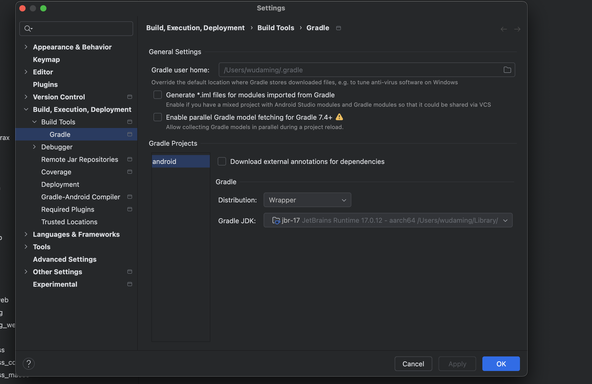

# Flutter Config

值得注意的是jdk-dir的值，根据描述，优先使用Android Studio自带的jdk ==> 次优先JAVA_HOME环境变量的值 ===> 最后在user目录查找。
如果项目使用的jdk不是Android Studio自带的jdk，则有可能会导致编译问题。
项目使用的jdk是在Android Studio里面配置，打开Android项目（flutter中的Android项目），在设置=> Build, Execution, Deployment => Build Tools => Gradle.


如果发生不一致，使用`flutter config --jdk-dir $JAVA_HOME`来设置新的值。具体的路径需要根据实际情况设置。
## usage

```plaintext
Usage: flutter config [arguments]
-h, --help                                 Print this usage information.
    --list                                 List all settings and their current
                                           values.
    --clear-ios-signing-cert               Clear the saved development
                                           certificate choice used to sign apps
                                           for iOS device deployment.
    --android-sdk                          The Android SDK directory.
    --android-studio-dir                   The Android Studio installation
                                           directory. If unset, flutter will
                                           search for valid installations at
                                           well-known locations.
    --jdk-dir                              The Java Development Kit (JDK)
                                           installation directory. If unset,
                                           flutter will search for one in the
                                           following order:
                                           1) the JDK bundled with the latest
                                           installation of Android Studio,
                                           2) the JDK found at the directory
                                           found in the JAVA_HOME environment
                                           variable, and
                                           3) the directory containing the java
                                           binary found in the user's path.
    --build-dir=<out/>                     The relative path to override a
                                           projects build directory.
    --[no-]enable-web                      Enable or disable Flutter for web.
    --[no-]enable-linux-desktop            Enable or disable support for desktop
                                           on Linux.
    --[no-]enable-macos-desktop            Enable or disable support for desktop
                                           on macOS.
    --[no-]enable-windows-desktop          Enable or disable support for desktop
                                           on Windows.
    --[no-]enable-android                  Enable or disable Flutter for
                                           Android.
    --[no-]enable-ios                      Enable or disable Flutter for iOS.
    --[no-]enable-fuchsia                  Enable or disable Flutter for
                                           Fuchsia.
                                           This setting applies only to the
                                           master channel.
    --[no-]enable-custom-devices           Enable or disable early support for
                                           custom device types.
    --[no-]cli-animations                  Enable or disable animations in the
                                           command line interface.
    --[no-]enable-native-assets            Enable or disable native assets
                                           compilation and bundling.
                                           This setting applies only to the
                                           master channel.
    --[no-]enable-flutter-preview          Enable or disable Flutter preview
                                           prebuilt device.
                                           This setting applies only to the
                                           master and beta channels.
    --[no-]enable-swift-package-manager    Enable or disable support for Swift
                                           Package Manager for iOS and macOS.
    --clear-features                       Remove all configured features and
                                           restore them to the default values.
```