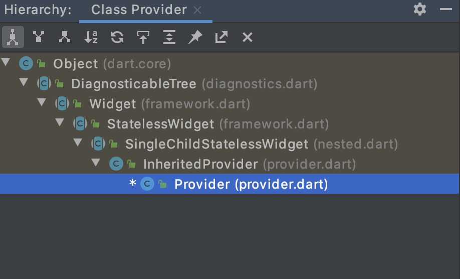
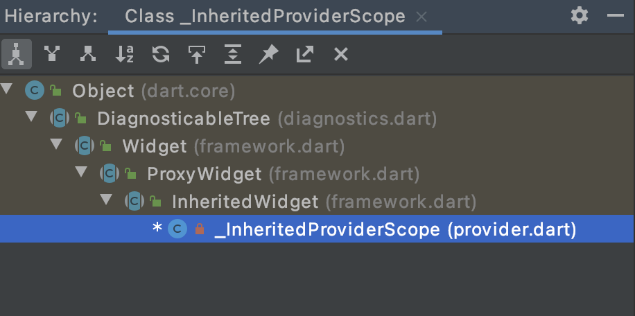

# Provider
一个Flutter官方团队提供的状态管理库。主要功能是在某个节点为所有子节点提供状态共享和状态更新。为我们提供更丰富、更方便的使用Inherited机制的方式。

## 简单使用

* Provider：数据提供者。Provider的实际类型很多，功能上有两大类：不变值和可变值。可变值改变是会通知Provider以及所有子节点rebuild。所以要注意Provider的位置以保证页面流畅度。
* Consumer：数据消费者。本身没有什么逻辑，仅提供一个`context.watch`的封装。

来个最简单的🌰

```
  @override
  Widget build(BuildContext context) {
    return Provider(create: (BuildContext context) {
      return 'ssss';
    }, child: Consumer<String>(builder: (context, value, child) {
      return Text(value);
    }));
  }
```

## 流程分析

### 普通状态
以Provider为🌰

继承关系


InteritedProvider

```
InheritedProvider({
    Key? key,
    Create<T>? create,
    T Function(BuildContext context, T? value)? update,
    UpdateShouldNotify<T>? updateShouldNotify,
    void Function(T value)? debugCheckInvalidValueType,
    StartListening<T>? startListening,
    Dispose<T>? dispose,
    this.builder,
    bool? lazy,
    Widget? child,
  })  : _lazy = lazy,
        _delegate = _CreateInheritedProvider(
          create: create,
          update: update,
          updateShouldNotify: updateShouldNotify,
          debugCheckInvalidValueType: debugCheckInvalidValueType,
          startListening: startListening,
          dispose: dispose,
        ),
        super(key: key, child: child);

  ...

  @override
  Widget buildWithChild(BuildContext context, Widget? child) {
    assert(
      builder != null || child != null,
      '$runtimeType used outside of MultiProvider must specify a child',
    );
    return _InheritedProviderScope<T>(
      owner: this,
      // ignore: no_runtimetype_tostring
      debugType: kDebugMode ? '$runtimeType' : '',
      child: builder != null
          ? Builder(
              builder: (context) => builder!(context, child),
            )
          : child!,
    );
  }

```
Provider并不是InteritedWidge的子类，而是一个SingleChildStatelessWidget，所有我们得看`buildWithChild`方法，进入_InheritedProviderScope。

继承关系

从这里可以看到_InheritedProviderScope是InteritedWidget。我们这是就能预知后面查找Element是用的就是_InheritedProviderScope。这个类本身并没有啥逻辑，直接来_InheritedProviderScopeElement。依据Interited的设计，_InheritedProviderScopeElement必然是InheritedElement的子类。

_InheritedProviderScopeElement
```
  @override
  bool get hasValue => _delegateState.hasValue;

  @override
  void markNeedsNotifyDependents() {
    if (!_isNotifyDependentsEnabled) {
      return;
    }

    markNeedsBuild();
    _shouldNotifyDependents = true;
  }

  @override
  void performRebuild() {
    if (_firstBuild) {
      _firstBuild = false;
      _delegateState = widget.owner._delegate.createState()..element = this;
    }
    super.performRebuild();
  }
```
在这里preformRebuild做了两件事：
1. 实例化了_delegateState。
2. 将自身的引用给_delegateState。
到这里并没有生产我们需要的值，也就是说没有使用我们传递给Provider的create的那个函数对象。Provider树的生成部分就结束了，下面考虑子树的生成过程。


Consumer：本身是SingleChildStatelessWidget，很简单。

```
  @override
  Widget buildWithChild(BuildContext context, Widget? child) {
    return builder(
      context,
      Provider.of<T>(context),
      child,
    );
  }
```

`Provider.of<T>(context)`流程：

```
  static T of<T>(BuildContext context, {bool listen = true}) {
  
    final inheritedElement = _inheritedElementOf<T>(context);

    if (listen) {
      context.dependOnInheritedElement(inheritedElement);
    }
    return inheritedElement.value;//重点分析，这里会到
  }

  ...

    static _InheritedProviderScopeElement<T> _inheritedElementOf<T>(
    BuildContext context,
  ) {
    _InheritedProviderScopeElement<T>? inheritedElement;

    if (context.widget is _InheritedProviderScope<T>) {
      // An InheritedProvider<T>'s update tries to obtain a parent provider of
      // the same type.
      context.visitAncestorElements((parent) {
        inheritedElement = parent.getElementForInheritedWidgetOfExactType<
            _InheritedProviderScope<T>>() as _InheritedProviderScopeElement<T>?;
        return false;
      });
    } else {
      inheritedElement = context.getElementForInheritedWidgetOfExactType<
          _InheritedProviderScope<T>>() as _InheritedProviderScopeElement<T>?;
    }

    if (inheritedElement == null) {
      throw ProviderNotFoundException(T, context.widget.runtimeType);
    }

    return inheritedElement!;
  }
```

`inheritedElement.value` => `_InheritedProviderScopeElement:_delegateState.value`=>`_DelegateState:T get value;`如果以Provider的默认构造方法为例的话就是`_CreateInheritedProviderState:`

```
@override
  T get value {
    if (_didInitValue && _value is! T) {
      throw StateError(
        'Tried to read a provider that threw during the creation of its value.\n'
        'The exception occurred during the creation of type $T.',
      );
    }
    bool? _debugPreviousIsInInheritedProviderCreate;
    bool? _debugPreviousIsInInheritedProviderUpdate;

    if (!_didInitValue) {
      _didInitValue = true;
      if (delegate.create != null) {
        try {
          _value = delegate.create!(element!);//这里调用我们传入的方法对象，官方文档的懒加载就体现在这里。值在用到的时候才初始化。
        } finally {
          
        }
      }
      if (delegate.update != null) {
        //先不管
      }
    }

    element!._isNotifyDependentsEnabled = false;
    _removeListener ??= delegate.startListening?.call(element!, _value as T);//这里后面会用到。
    element!._isNotifyDependentsEnabled = true;
    assert(delegate.startListening == null || _removeListener != null);
    return _value as T;
  }
```

到这里整个Provider流程就结束了。

以为完了吗？？？


## ListenableProvider
一个完美的响应式，当数据改变，界面随即改变，不需要额外操作。这里以ListenableProvider为例分析，其他如ChangeNotifierProvider、FutureProvider、StreamProvider、ValueListenableProvider原理类似。

ListenableProvider 
```
//构造方法多个一个东西_startListening。
  ListenableProvider({
    Key? key,
    required Create<T> create,
    Dispose<T>? dispose,
    bool? lazy,
    TransitionBuilder? builder,
    Widget? child,
  }) : super(
          key: key,
          startListening: _startListening,
          create: create,
          dispose: dispose,
          lazy: lazy,
          builder: builder,
          child: child,
        );
  ...

  static VoidCallback _startListening(
    InheritedContext e,
    Listenable? value,
  ) {
    value?.addListener(e.markNeedsNotifyDependents);
    return () => value?.removeListener(e.markNeedsNotifyDependents);
  }
```

往回看，在_CreateInheritedProviderState的value get中，会调用_startListening这个方法。下面看看markNeedsNotifyDependents是什么，还是往回倒InheritedProviderScopeElement的代码中，markNeedsNotifyDependents()=》markNeedsBuild(),系统方法，标记下帧重绘。那么响应式的到此结束。Future和Stream的类似，只不过不是回调方式不一样。

## ProxyProvider
在前面_CreateInheritedProviderState代码value获取的流程可以发现，一块重要的逻辑是delegate.update，这个属性一直没有赋值。这个值在ProxyProvider会被赋值。流程上依附于签名的流程就很简单了。主要说明下ProxyProvider的设计目的，当一个Provider的值依赖于另一个Provider时，使用ProxyProvider可以方便的做到页面更新(也不是很懂！)。